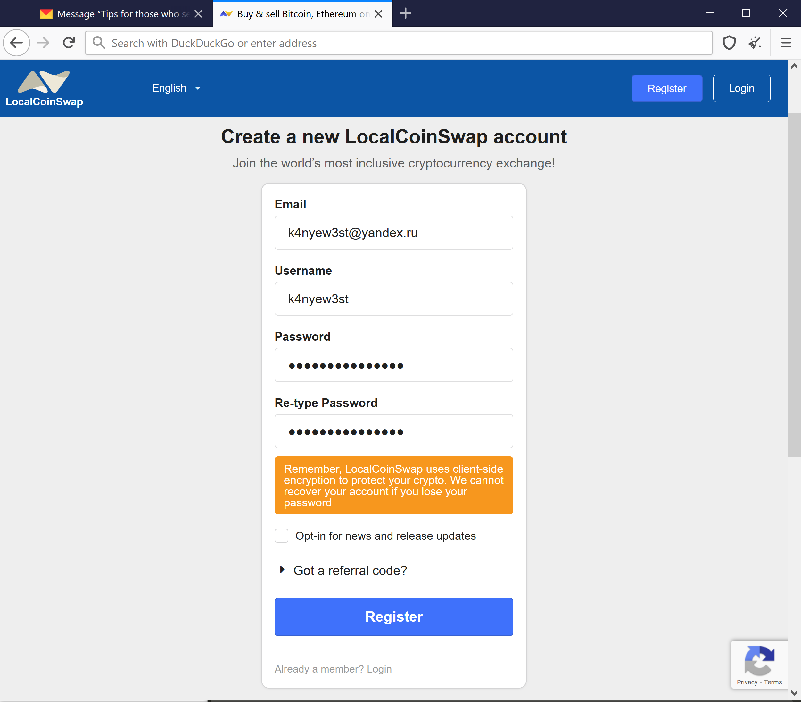

# A guide on how to purchase bitcoin anonymously without ID

## ⚠️ Important ⚠️ :

* **There always is a chance you can get scammed by using this method, keep that in mind!**

* **This guide will only help you if you don't plan to convert the bitcoin back to normal cash due it being only meant being for a one way system where you only buy stuff with the bitcoin. If you convert it back to normal cash, agencies and the government can track payments back to you!**

------------------------------------------

1.  **Download the Tor Browser** from [https://www.torproject.org/download/](https://www.torproject.org/download/).

2.  **Open the Tor Browser and go to Yandex Mail**, which is at [https://mail.yandex.com/](https://mail.yandex.com/).  
    _Yandex is the Russian Google and Yandex Mail is the Russian Gmail. We can’t use Gmail or Outlook.com because they will require phone verification and will block us from logging in if we are entering from a different IP than the one we registered on. On the other side, we cannot use temporary email services, like_ [_guerrillamail.com_](https://www.guerrillamail.com/)_, as websites often do not allow those email addresses to be used when registering._

3.  **Click “Create an account”.**

4. **Enter a name, login, and password** — making sure that the name and login cannot be traced back to your real identity. Copy the login and password to a text file and save it — you will need this later.

5. On the last question it asks for a mobile number. Do not enter a mobile number. Instead **click “I don’t have a mobile phone”**.

6. This will prompt you to **choose and answer a security question**. Save the answer to the security question in the text file with the login and password.

7. **Enter the captcha and click “Register”**

8. On a new Tor Browser tab, **go to** [**https://localcoinswap.com/register/**](https://localcoinswap.com/register/).  
_This is a P2P crypto marketplace. The benefit of this P2P marketplace over others is that is two-fold. First, most P2P marketpalces, like localbitcoin.com, require phone verification when registering — we are trying to avoid this. Second, most other P2P marketplaces do not have the cash-by-mail options anymore as it goes against their KYC (Know Your Customer) policies._

9. **In the email field, enter the email address you created earlier**. This will be in the format [login]@yandex.ru.

10. **Enter the other details** as you choose. Make sure they cannot be connected back to your real identity.

11. **Save the username and password in the text file you crated earlier**.

12. **Click “Register”**.

13. **Complete the Google reCAPTCHA**.

14. If you encounter an error with the captcha, as shown below, you need to **click the “New Identity” button**. It is pointed to with the red arrow in the picture below. You will get a prompt which will ask you to confirm that you want to restart the Tor Browser. Click “Yes”.

Now **repeat step 9 to step 14 til you get through**. It typically takes between 5 and 10 tries to get an identity which works with Google reCAPTCHA, but it may take more. Be patient, put on a YouTube video in the background, copy and paste from the text file, and you will eventually get through.

15. Once you have successfully created an account, **go back to** [**https://mail.yandex.com/**](https://mail.yandex.com/) **and enter your login information for the account you created earlier.**

16. **Open the verification email** you received from LocalCoinSwap.com. If its not in your Inbox, make sure to check the Spam and Subscriptions folders.

17. **Click “Verify Email!”**.

18. That will take you to the login page on LocalCoinSwap.com. **Enter your email address and then your password and click “Sign In”**.

19. You will likely once again encounter the Google reCAPTCHA error as shown below. Once again **click the “New Identity” button (shown with the red arrow below) and repeat step 15 to 19 til you get through**.

You will know that you have gotten through the screen below.

20. **Go back to your Yandex email**, find the new email which asks you to approve your login. Then **click “Approve Login!”**.

Now when you go back to the tab which asked you to check your email, you should see the following screen. Congratulations you have registered successfully!

21. **Go to** [**https://localcoinswap.com/en/buy/crypto/worldwide/cash-by-mail**](https://localcoinswap.com/en/buy/crypto/worldwide/cash-by-mail)

All these people are selling bitcoin for cash-in-mail. This means put cash in an envelope then send it to the address they give you and in return you get bitcoin.

22. Find a seller who **does not require you to verify your ID, or verify your phone number, or contact them by text or phone**.

For example, the seller below requires you to text them. This will reveal your identity, hence don’t buy from sellers such as this.

Below is an example of a good seller. They don’t ask your for identifying information.

23. Once you find a seller who will protect your anonymity, **open a trade with them and follow their instructions**.

24. **Practice good physical OpSec**.

Do not buy prepaid envelopes or purchase stamps online! Buy generic envelopes, stamps, a birthday card, and a stick of glue (do not lick stamps or envelopes) from a physical store. Purchase these items using cash only. Do not use a credit or debit card!

When handling these items wear gloves and make sure your fingerprints don’t get on them at any point.

The bitcoin seller will likely ask your to include your username and transaction ID. Write all of that information using pen and paper. Do not print it out as [printers print a hidden a number on the paper that is traceable to your printer](https://www.youtube.com/watch?v=sit6zUQKpJc).

Write a message on the birthday card saying something like, “have a great birthday from grandma and hope you enjoy your present.” Then place the cash inside the birthday card. Do not lick the stamps or envelope — that’s what the glue is for. Use a mailbox that is not nearby your house.

25. Once you receive the bitcoin in your LocalCoinSwap.com account, transfer the coins to Electrum Wallet in Tails or Whonix, or transfer them directly to their final destination. **Do not transfer the bitcoins to an account you access outside Tor!**
